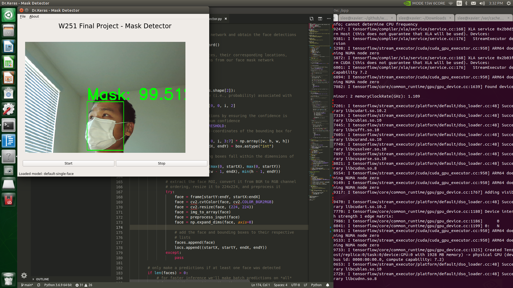

# How to run on Jetson Xavier NX

## 1. Update docker setting to build in GPU-enabled environment

a. Install nvidia-container-runtime:

```
sudo apt-get install nvidia-container-runtime
```

b. Edit/create the /etc/docker/daemon.json with content:
```
{
    "runtimes": {
        "nvidia": {
            "path": "/usr/bin/nvidia-container-runtime",
            "runtimeArgs": []
         } 
    },
    "default-runtime": "nvidia" 
}
```
c. Restart docker daemon:

```
sudo systemctl restart docker
```

## 2. Run the following command in the project root directory
```
xhost + 
docker-compose up
```


## Note 
Wait 15 seconds after pressing "start" button. -- this will be fixed.
